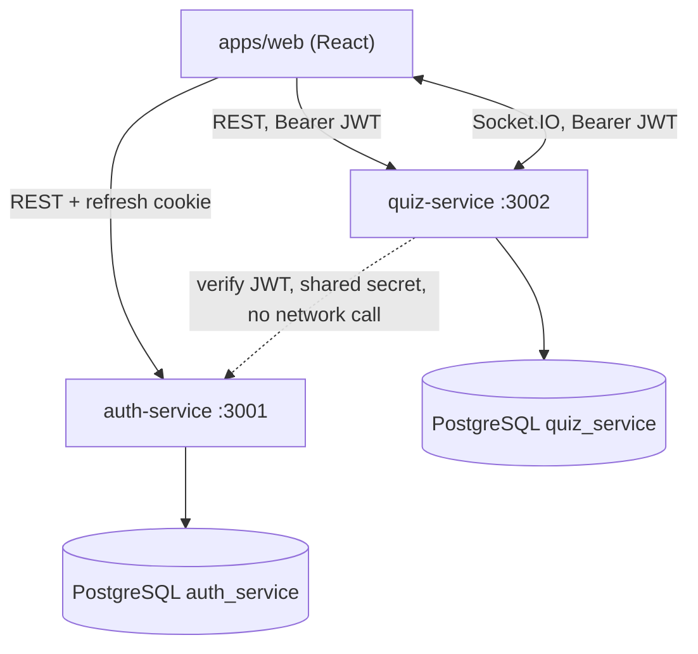
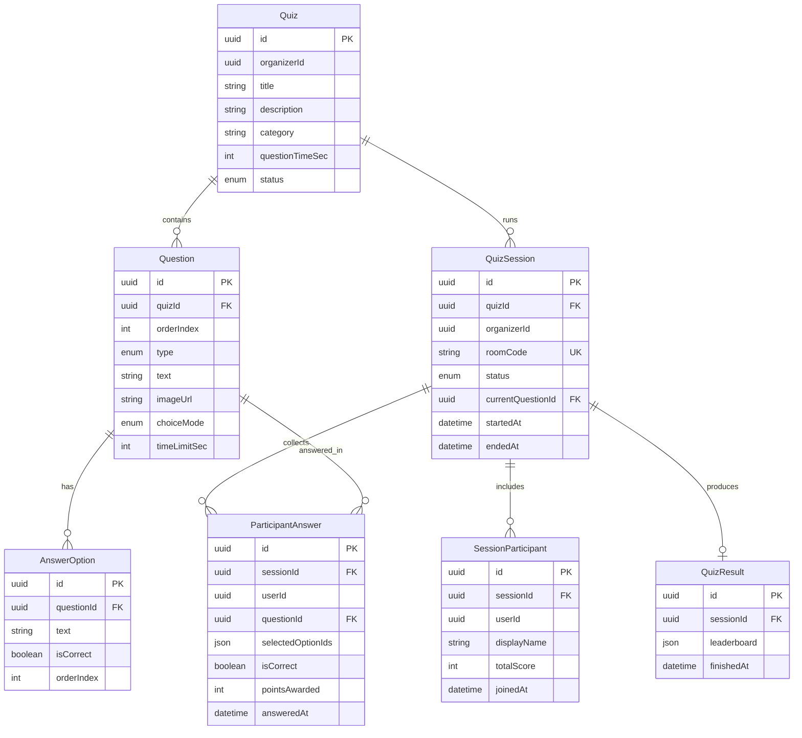
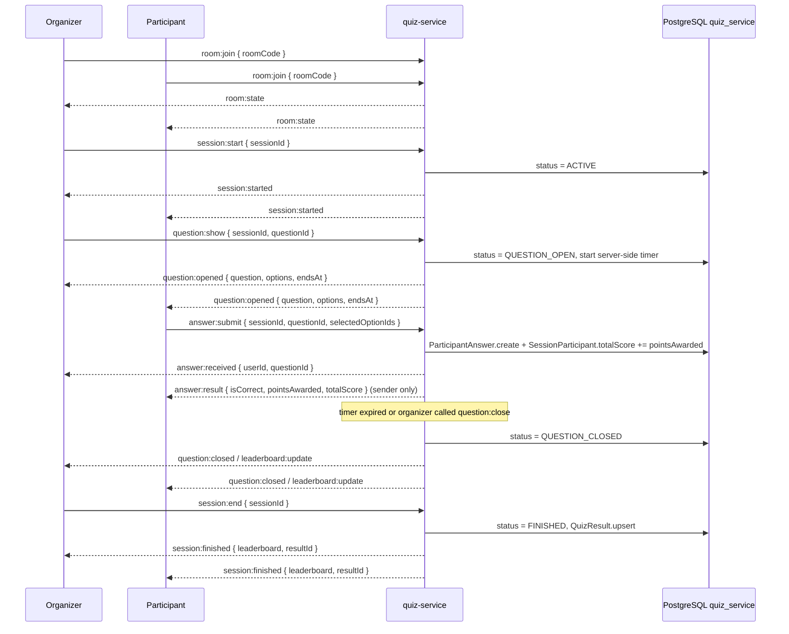

# Quiz Pools

A live-quiz platform: an organizer creates a quiz and starts a session under a room code, participants join and answer in real time.

## Tech Stack

| Layer | Technologies | Explanation of choice |
| --- | --- | --- |
| Frontend | React 18, Vite, Socket.IO client | Technical specifications |
| Backend | Node.js, Express, TypeScript | Technical specifications | 
| ORM / DB | Prisma 5, PostgreSQL 16 | PSQL - technical specifications, Prisma - in my opinion, this is the most convenient ORM for not writing queries manually | 
| Realtime | Socket.IO 4 | Technical specifications and managing real-time answer while quiz session | 
| Auth | JWT (access + refresh httpOnly cookie), bcrypt | Technical specifications and access control while session & whole experience | 
| Infrastructure | Docker Compose, Nginx (frontend static hosting) | Docker - microservices holding & orchestration, Nginx - routes manage |

## Microservices

| Service | Port | Responsibility |
| --- | --- | --- |
| `apps/web/quiz-pools` | 3000 | React SPA: auth, quiz builder, live session (organizer/participant), leaderboard, history |
| `services/auth-service` | 3001 | Registration, login, JWT issuance/refresh, user profile |
| `services/quiz-service` | 3002 | Quiz/question CRUD, live sessions (rooms, question reveal, timer), scoring, leaderboard, history, Socket.IO |

`auth-service` and `quiz-service` are independent processes with separate databases, each with its own Prisma client. The only shared resource is the JWT signing secret: `auth-service` issues tokens, `quiz-service` only verifies them (no network call between the services).



## Database Schema

### `auth_service`

```prisma
enum Role {
  MEMBER
  ORGANIZER
}

model User {
  id            String   @id @default(uuid())
  name          String
  email         String   @unique
  password_hash String
  role          Role     @default(MEMBER)
  createdAt     DateTime @default(now())
  updatedAt     DateTime @updatedAt
}
```

### `quiz_service`



Unique constraints: `Question(quizId, orderIndex)`, `QuizSession.roomCode`, `SessionParticipant(sessionId, userId)`, `ParticipantAnswer(sessionId, userId, questionId)`, `QuizResult.sessionId`. Cascade delete flows from `Quiz` down to `AnswerOption`/`ParticipantAnswer`/`QuizResult`.

The link between the `auth_service` and `quiz_service` databases is by value only (`userId`/`organizerId`, the uuid from the JWT `sub` claim) — there is no foreign key across databases.

## Entities

| Entity | Database | Meaning |
| --- | --- | --- |
| `User` | auth_service | Account; carries a `role` (`MEMBER` default or `ORGANIZER`) chosen at registration, shown on the home page as "name - role". The role is informational — authorization is still ownership-based, so any user can create quizzes and join others' regardless of `role` |
| `Quiz` | quiz_service | A quiz: title, category, default per-question time, lifecycle status |
| `Question` | quiz_service | A quiz question: text or image, choice mode (single/multiple correct) |
| `AnswerOption` | quiz_service | An answer option for a question, flagged `isCorrect` |
| `QuizSession` | quiz_service | A live run of a quiz: room identified by `roomCode`, state, current question |
| `SessionParticipant` | quiz_service | A participant in a session and their running score |
| `ParticipantAnswer` | quiz_service | A recorded answer from a participant to a question within a session |
| `QuizResult` | quiz_service | The final leaderboard snapshot after a session ends |

Authorization is ownership-based: an organizer can only modify quizzes/sessions where `organizerId === user.id`; a participant can only submit answers as their own `userId`.

## Data Flow

### 1. Frontend ↔ auth-service (REST)

| Method | Path | Input | Output |
| --- | --- | --- | --- |
| POST | `/api/auth/register` | `{ name, email, password, role? }` (`role` defaults to `MEMBER`) | `{ user, accessToken }` + `Set-Cookie refreshToken` (httpOnly, `path=/api/auth`) |
| POST | `/api/auth/login` | `{ email, password }` | `{ user, accessToken }` + `Set-Cookie refreshToken` |
| POST | `/api/auth/refresh` | cookie `refreshToken` | `{ user, accessToken }` + new `Set-Cookie` |
| POST | `/api/auth/logout` | — | `Clear-Cookie refreshToken` |
| GET | `/api/auth/me` | `Authorization: Bearer <accessToken>` | `{ user }` |

The frontend keeps the access token client-side and sends it as `Authorization: Bearer` on every `quiz-service` request; the refresh token only ever travels as an httpOnly cookie scoped to `auth-service`.

### 2. Frontend ↔ quiz-service (REST, `Authorization: Bearer <accessToken>`)

| Method | Path | Input | Output |
| --- | --- | --- | --- |
| GET | `/api/quizzes` | — | quizzes owned by the current `organizerId` |
| POST | `/api/quizzes` | `{ title, description?, category?, questionTimeSec? }` | quiz in `DRAFT` status |
| GET | `/api/quizzes/:id` | — | quiz + questions + options |
| PATCH | `/api/quizzes/:id` | partial quiz fields | updated quiz |
| DELETE | `/api/quizzes/:id` | — | — |
| POST | `/api/quizzes/:id/publish` | — | quiz with status `PUBLISHED` |
| POST | `/api/quizzes/:quizId/questions` | `{ orderIndex, type, text, imageUrl?, choiceMode, timeLimitSec?, options[] }` | created question |
| PATCH | `/api/questions/:id` | partial question fields | updated question |
| DELETE | `/api/questions/:id` | — | — |
| PUT | `/api/questions/:id/options` | `{ options[] }` | question with the replaced option set |
| POST | `/api/sessions` | `{ quizId }` | session with a generated `roomCode` (quiz must be `PUBLISHED`) |
| GET | `/api/sessions/by-code/:roomCode` | — | session + quiz |
| POST | `/api/sessions/:id/join` | — | `{ session, participant }` (the session's own organizer cannot join) |
| GET | `/api/sessions/:id/state` | — | snapshot of the current question/deadline — to catch up on a missed broadcast |
| POST | `/api/sessions/:id/start` | — | session in status `ACTIVE` |
| POST | `/api/sessions/:id/questions/:questionId/show` | — | session in status `QUESTION_OPEN`, starts the server-side timer |
| POST | `/api/sessions/:id/questions/close` | — | session in status `QUESTION_CLOSED` |
| POST | `/api/sessions/:id/answers` | `{ questionId, selectedOptionIds[] }` | `{ isCorrect, pointsAwarded, totalScore }` |
| POST | `/api/sessions/:id/end` | — | session `FINISHED` + persisted `QuizResult` |
| GET | `/api/sessions/:id/leaderboard` | — | `{ entries: [{ userId, name, score, rank }] }` |
| GET | `/api/history/organized` | — | sessions the user has hosted |
| GET | `/api/history/participated` | — | sessions the user has played |
| GET | `/api/history/sessions/:sessionId` | — | session detail + leaderboard snapshot |

`quiz-service` verifies `accessToken` with the same `JWT_SECRET` that `auth-service` signed it with; no network call to `auth-service` happens at request time.

### 3. Frontend ↔ quiz-service (Socket.IO)

Handshake: `auth: { token: accessToken }`, verified with the same `JWT_SECRET` as REST.



| Direction | Event | Payload |
| --- | --- | --- |
| Client → Server | `room:join` | `{ roomCode }` |
| Client → Server | `session:start` | `{ sessionId }` |
| Client → Server | `question:show` | `{ sessionId, questionId }` |
| Client → Server | `question:close` | `{ sessionId }` |
| Client → Server | `answer:submit` | `{ sessionId, questionId, selectedOptionIds[] }` |
| Client → Server | `session:end` | `{ sessionId }` |
| Server → Room | `room:state` | `{ session, participantsCount }` |
| Server → Room | `session:started` | `{ sessionId, quizTitle }` |
| Server → Room | `question:opened` | `{ question, options, endsAt }` |
| Server → Room | `question:closed` | `{ questionId }` |
| Server → Room | `answer:received` | `{ userId, questionId }` |
| Server → Room | `leaderboard:update` | `{ entries: [{ userId, name, score, rank }] }` |
| Server → Room | `session:finished` | `{ leaderboard, resultId }` |
| Server → Client | `error` | `{ code, message }` |

The question timer (`endsAt`) is set and tracked by the server; answers are rejected after `question:close` or once the timer expires. The organizer joins the socket room (`room:join`) but is not created as a `SessionParticipant` and does not appear on the leaderboard.

### 4. quiz-service ↔ auth-service

There are no direct calls between the services. The only link is the shared `JWT_SECRET`/payload `{ sub, email, name, role }`: `auth-service` signs the token, `quiz-service` verifies it locally and reads `userId` from `sub`. `quiz-service` does not read `role` — authorization there stays ownership-based (`organizerId === user.id`).

### 5. Services ↔ PostgreSQL

`auth-service` and `quiz-service` each run a separate Prisma client against their own logical database (`auth_service`, `quiz_service`) on one shared PostgreSQL instance. There are no cross-database queries; `organizerId`/`userId` inside `quiz_service` are plain UUID strings with no foreign key into `auth_service.User`.
